<p align="right">
  <a href="nfc-skill-card-design.zh_CN.md">简体中文</a> · <strong>English</strong>
</p>

# Writable NFC Skill Card Design

Status: design baseline for review. No implementation is implied by this document.

## Product decision

An AI Passport NFC card is a user-writable trigger. It selects an installed local Skill, an IDE adapter, and a mode. The card does not contain the Skill implementation, credentials, absolute paths, shell commands, or an executable prompt.

Version 1 uses the free Android edition of NFC Tools only as a generic NDEF writer. The configurator produces one text record; the user adds that record manually in NFC Tools and writes it to the card. Version 1 does not depend on NFC Tools profiles, imports, deep links, intents, or undocumented file formats.

Version 2 may add a GitHub-backed manifest. When the referenced Skill is missing, Passport Host Service can install it under an explicit trust policy and then invoke it. The card still carries only a bounded reference and public metadata.

## Confirmed card baseline

The card inspected on 2026-09-18 reports:

- ISO 14443-3A, NfcA and NDEF;
- NFC Forum Type 2;
- 137 bytes available for NDEF content;
- writable and capable of being made read-only;
- empty at the time of inspection.

The source screenshot is intentionally not stored because it contains the card's unique serial number. The card must remain writable during the MVP. Do not enable permanent read-only locking or password protection during development.

## System boundary

```text
Local PC
  Passport Host Service
    ├── Card Ingress + Card Codec
    ├── Capability Catalog
    │     ├── IDE Adapter Registry
    │     └── Installed Skill Registry
    ├── Policy Engine + Skill Installer (Version 2)
    ├── Runtime Orchestrator
    ├── Device Gateway (the existing Bridge transport)
    └── Configurator API + local page
             │
             │ text / QR handoff
             ▼
Android phone
  NFC Tools Free
    └── manually writes one NDEF Text record
             │
             ▼
       Writable Type 2 card
```

Passport Host Service is the sole owner of card recognition, schema parsing, capability discovery, Skill resolution, installation policy, IDE dispatch, and execution state. The HTML configurator is only a client of this service. NFC Tools owns only the physical write operation, and IDE adapters cannot install or resolve a Skill independently.

This design uses two explicit names to avoid confusing the host product with the existing embedded state machine:

- **Passport Host Service** runs on the local PC and owns card-to-capability orchestration.
- **Passport Device Service Core** is the existing firmware state machine in `main/passport_service.c`. It displays bounded resolved state and emits physical actions; it never installs or executes a Skill.

The current `tools/passport_bridge.py` becomes the Host Service entry point or its Device Gateway module. It is no longer a separate product boundary. Passport firmware continues to receive resolved state such as `nfc.present`, `tile.stack.state`, `context.composed`, and `goal.mode.state` from that gateway.

## Full user journey DAG

The diagram follows one card from preparation to one completed IDE run. Retry and rewrite actions start a new attempt, so they end at explicit terminal nodes instead of introducing cycles into the DAG. The solid Version 1 path uses manual NFC Tools writing and local Skill resolution. The dashed Version 2 branch is the later remote-install path.

```mermaid
flowchart TD
    U0([User receives an empty writable Type 2 card])
    H0[Start Passport Host Service]

    subgraph CONFIG[Configure on the local PC]
        H1[Capability Catalog scans available IDE adapters]
        H2[Skill Registry scans installed local Skills]
        C1[Configurator displays available IDEs, modes, and Skills]
        U1[User selects IDE, mode, and Skill]
        C2[Card Codec generates canonical aip:1 text]
        C3{Payload and NDEF footprint fit the card?}
        C4[Show exact text, byte count, QR code, and download]
        E0([Stop: shorten or change the configuration])
    end

    subgraph WRITE[Write and verify on Android]
        P1[Move the text to the Android phone]
        P2[Open NFC Tools Free]
        P3[Add one NDEF Text record]
        P4[Place phone against card and write]
        P5[Read the card back in NFC Tools]
        P6{Read-back text is an exact match?}
        CARD([Configured AI Passport card])
        E1([Stop: erase and rewrite in a new attempt])
    end

    subgraph INGEST[Recognize and resolve in Passport Host Service]
        A1[Card content enters through manual MVP test,<br/>later Android relay, or future Reader]
        A2[Card Ingress normalizes UID and NDEF text]
        A3[Card Codec validates schema, fields, charset, and length]
        A4{Card record is valid and supported?}
        A5[Capability Catalog resolves IDE and mode]
        A6{IDE and mode are available?}
        A7[Skill Registry resolves Skill ID]
        A8{Skill is installed and unambiguous?}
        UI1[Host emits a bounded card.validation failure reason]
        UI2[Passport shows the CARD.INVALID pixel prompt<br/>and preserves the pre-scan screen]
        E2([Stop: card.invalid or unsupported version])
        E3([Stop: ide.not_found or mode.unsupported])
        E4([V1 stop: skill.not_found or skill.conflict])
    end

    subgraph INSTALL[Version 2 remote Skill installation]
        V1{Card has a remote manifest reference?}
        V2[Fetch manifest and immutable GitHub revision]
        V3[Verify source, integrity, layout, and requested permissions]
        V4{Allowed by trust policy or explicit approval?}
        V5[Skill Installer stages and validates the Skill]
        V6{Installation succeeded?}
        V7[Atomically register the installed Skill]
        E5([Stop: no install source])
        E6([Stop: source, integrity, or permission rejected])
        E7([Stop: installation failed])
    end

    subgraph RUN[Invoke the IDE and return state]
        R1[Runtime Orchestrator creates one normalized execution request]
        R2[Selected IDE Adapter translates the request]
        R3[IDE starts or resumes a session and loads the Skill]
        R4{IDE requests approval?}
        R5[IDE continues the task]
        R6[Host Service emits task, context, Skill, and Goal state]
        R7[Device Gateway sends bounded Passport protocol messages]
        R8[Passport Device Service Core updates the pixel UI]
        R9([Task completes or fails with a visible final state])
        AP1[IDE Adapter emits approval.request]
        AP2[Device Gateway forwards the request]
        AP3[Passport displays the approval prompt]
        AP4[User approves or rejects with a physical button]
        AP5[Device Gateway returns approval.decision]
        AP6[IDE Adapter replies to the IDE]
    end

    U0 --> H0
    H0 --> H1
    H0 --> H2
    H1 --> C1
    H2 --> C1
    C1 --> U1 --> C2 --> C3
    C3 -- No --> E0
    C3 -- Yes --> C4 --> P1
    P1 --> P2 --> P3 --> P4 --> P5 --> P6
    P6 -- No --> E1
    P6 -- Yes --> CARD --> A1
    A1 --> A2 --> A3 --> A4
    A4 -- No --> UI1 --> UI2 --> E2
    A4 -- Yes --> A5 --> A6
    A6 -- No --> E3
    A6 -- Yes --> A7 --> A8
    A8 -- Yes --> R1
    A8 -- No, Version 1 --> E4
    A8 -. No, Version 2 .-> V1
    V1 -- No --> E5
    V1 -- Yes --> V2 --> V3 --> V4
    V4 -- No --> E6
    V4 -- Yes --> V5 --> V6
    V6 -- No --> E7
    V6 -- Yes --> V7 --> R1
    R1 --> R2 --> R3 --> R4
    R4 -- No --> R5
    R4 -- Yes --> AP1 --> AP2 --> AP3 --> AP4 --> AP5 --> AP6 --> R5
    R5 --> R6 --> R7 --> R8 --> R9
```



The card never reaches an IDE adapter directly. Every success and failure passes through Passport Host Service, and Passport Device Service Core receives only bounded resolved state.

## Passport Host Service components

| Component | Responsibility |
| --- | --- |
| Card Ingress | Accept card UID and NDEF text from a manual test, phone relay, or future reader adapter. |
| Card Codec | Canonically encode and strictly parse versioned `aip` records. |
| Capability Catalog | Publish the IDEs, modes, and installed Skills that can actually run on this PC. |
| Skill Registry | Resolve one canonical Skill ID to one installed, validated local Skill. |
| Policy Engine | Decide whether a missing Skill may be installed and which permissions require confirmation. |
| Skill Installer | Version 2 only: fetch, verify, stage, validate, and atomically register a remote Skill. |
| Runtime Orchestrator | Turn a resolved card into one execution request and maintain its lifecycle. |
| IDE Adapters | Translate the normalized request and events for Codex, Trae, or a later IDE. |
| Device Gateway | Exchange bounded display, task, approval, and action messages with Passport firmware. |
| Configurator API | Serve the local UI and expose read-only capability discovery plus record generation and testing. |

All entry paths call the same Card Codec and Runtime Orchestrator. The configurator's Test locally action, an Android relay, and a future hardware reader therefore cannot drift into separate card semantics.

## Version 1 card record

The canonical record is an ASCII NDEF Text payload:

```text
aip:1;i=codex;m=agent;s=review
```

Fields are serialized in the fixed order shown below.

| Field | Meaning | Rule |
| --- | --- | --- |
| `aip:1` | AI Passport card schema version 1 | required and exact |
| `i` | IDE adapter ID | required; selected from the local adapter registry |
| `m` | adapter mode | required; selected from modes advertised by that adapter |
| `s` | canonical Skill ID | required; selected from the installed Skill registry |

Values use lowercase ASCII and match `[a-z0-9._-]+`. Limits are 16 bytes for `i`, 16 bytes for `m`, and 48 bytes for `s`. The complete text payload must not exceed 96 UTF-8 bytes. The encoder must also calculate the final NDEF footprint and refuse any record that exceeds the detected card capacity.

The parser rejects duplicate fields, unknown fields, unsupported versions, invalid characters, empty values, and trailing data. Version 1 has no optional extension field. A later schema version must be used when the contract changes.

Version 1 deliberately excludes:

- absolute project or Skill paths;
- repository URLs and branches;
- credentials, tokens, cookies, private keys, or user identifiers;
- prompts, shell commands, environment variables, or approval decisions;
- arbitrary arguments passed directly to an IDE command.

The working directory remains the active workspace selected when Passport Host Service starts. A future local workspace alias may be added only in a new schema version.

## Local registries

### IDE Adapter Registry

Each adapter publishes a bounded descriptor:

```json
{
  "id": "codex",
  "label": "Codex",
  "available": true,
  "modes": ["agent"],
  "capabilities": ["task_progress", "approval", "voice"]
}
```

The configurator displays only available adapters and their advertised modes. The resolver does not pass the card's `i` or `m` values into a command line. It maps them to an adapter and mode that already exist in the registry.

### Installed Skill Registry

Version 1 indexes already installed Skills from configured user-level and project-level roots. A registry entry contains at least:

```json
{
  "id": "review",
  "label": "Review",
  "revision": "0.3.2",
  "source": "project",
  "supported_ide": ["codex"],
  "path": "/local/path/not-written-to-card"
}
```

Skill IDs must be unique after provider discovery. If two providers expose the same ID, the registry marks the ID as conflicted and the configurator refuses to encode it until the user resolves the collision. File paths stay local and never enter the NFC record.

## Configurator experience

The Version 1 configurator is served by Passport Host Service on the local PC because that is where IDEs and Skills can be discovered accurately. The page does not scan directories or invoke an IDE itself; it reads the Capability Catalog and asks the Host Service to generate or test a record.

```text
Choose IDE
  → choose one mode supported by that IDE
  → search and choose one installed Skill
  → preview the resolved local configuration
  → generate the canonical NFC text
  → copy the text, show a QR code, or download a .txt file
```

The result page shows:

- the IDE, mode, Skill name, Skill revision, and local source;
- the exact canonical record;
- encoded byte count and card capacity;
- a warning that the card is writable and untrusted;
- buttons for Copy, Show QR, Download text, and Test locally;
- the manual NFC Tools Free instructions.

The QR code contains the canonical record itself, not a credential or a hosted profile. It is a handoff convenience for moving the text from PC to phone.

## Manual write flow with NFC Tools Free

1. Generate the canonical text in the configurator.
2. Move it to the Android phone by copy/share or by scanning the displayed QR code.
3. Open NFC Tools and choose Write.
4. Add one Text record and paste the canonical text without extra whitespace.
5. Choose Write and place the phone against the card.
6. Return to Read, scan the card, and confirm that the text matches exactly.
7. Leave the card writable. Do not choose permanent read-only protection.

The MVP does not generate an NFC Tools import package. The free app's normal Text-record workflow is the supported write path.

## Version 1 activation and validation

The first MVP validates the data contract and local resolution before adding a one-tap phone runtime.

1. NFC Tools reads the newly written Text record back.
2. The operator copies the read-back text into the configurator's Test locally field.
3. Passport Host Service sends the input through its Card Codec, which produces `ide_id`, `mode`, and `skill_id` only after strict validation.
4. The Runtime Orchestrator resolves those IDs through the Capability Catalog and Skill Registry.
5. A successful resolution becomes one normalized execution request for the selected IDE adapter.
6. A missing Skill returns `skill.not_found`; Version 1 never installs it.
7. The Device Gateway sends the resulting task, context, Skill, and Goal state through the existing Passport protocol.

This is intentionally a manual acceptance path. Automatic scanning and relay from Android is a separate follow-up and must not delay the Version 1 schema test.

## Errors are product states

Card Codec first answers whether this is a recognizable AI Passport card.
Capability Catalog and Skill Registry answer whether the local computer can run
it only after that schema check passes. These failures are intentionally
separate: one means the card protocol is invalid; the other means the card is
valid but this computer does not yet have the requested capability.

### Recognition and interception order

1. Card Ingress accepts and normalizes one NDEF Text record. An empty record,
   conflicting Text records, or content over the ingress limit never reaches
   IDE resolution.
2. Card Codec validates the `aip:` prefix, version, required fields, field
   uniqueness, allowed characters, length, and unknown-field policy. Failure
   stops immediately and cannot create a Runtime Orchestrator request.
3. IDE, mode, and Skill resolution begins only after schema validation. These
   are capability errors and must not use the “wrong card” prompt.
4. Device Gateway sends a reason enum, never raw NDEF. The device presents
   `CARD.INVALID` and restores the pre-scan screen after 4 seconds or dismissal.

| Code | Bounded reason | Passport prompt | Result |
| --- | --- | --- | --- |
| `card.invalid` | `empty` / `not_aip` | “Oops, this card doesn't look quite right” / “Not an AI Passport card” | Do not start an IDE or change the current session |
| `card.invalid` | `malformed` | “Oops, this card doesn't look quite right” / “Card setup is incomplete” | Do not create an execution request |
| `card.unsupported_version` | `unsupported_version` | “Oops, this card doesn't look quite right” / “Is this card from the future?” | Suggest updating Host Service; do not guess a downgrade |
| `ide.not_found` | `ide_unavailable` | “This IDE isn't ready yet” | Card is valid; retain the previous session |
| `mode.unsupported` | `mode_unavailable` | “This mode isn't available yet” | Card is valid; do not silently switch mode |
| `skill.not_found` | `skill_missing` | “This Skill hasn't moved into your computer yet” | Stop in Version 1; only Version 2 may enter installation |
| `skill.conflict` | `skill_conflict` | “Two Skills answered to the same name” | Resolve the conflict on the PC |
| `card.capacity_exceeded` | `too_large` | Configurator says “This card can't hold all that” | Pre-write error; do not send it to the device |

The Host sends a bounded device message. Exact field names may be aligned with
the final wire contract, but the semantics must remain stable:

```json
{
  "type": "card.validation",
  "state": "invalid",
  "reason": "malformed",
  "card_id": "display-only-debounced-id"
}
```

`state` accepts only `accepted`, `invalid`, or `unsupported`; `reason` must be a
negotiated enum. An unknown enum uses the generic `malformed` copy instead of
rendering an arbitrary server string. `card_id` exists only for display
correlation and the 1.5-second debounce window; it never authorizes execution.

An invalid-card event is a read-only overlay. It does not change the card stack,
selected session, task snapshot, Goal, Skill binding, or route epoch. OK only
dismisses and re-arms the waiting state; it cannot synthesize a new read. Retry
requires a fresh phone-relay or reader event. Duplicate reports for the same
card inside the debounce window do not restart the animation.

Display priority is approval, recording, invalid-card feedback, switching, then
ordinary navigation. An invalid-card notice queues behind approval or recording
instead of covering a decision or recording result. No failure silently falls
back to another IDE, mode, or Skill. The configurator, Host log, and Passport
screen use the same bounded reason.

## Version 2 remote Skill source

Version 2 adds a source manifest while preserving Version 1's local-first behavior. A card may refer to a short platform manifest URL or a compact GitHub source reference. A full repository configuration is not forced into a 137-byte card.

The remote manifest contains:

```json
{
  "schema": 1,
  "skill_id": "review",
  "repository": "https://github.com/example/passport-skills",
  "commit": "full immutable commit SHA",
  "subdirectory": "skills/review",
  "integrity": "sha256:...",
  "supported_ide": ["codex"],
  "permissions": ["repo.read"]
}
```

Passport Host Service owns the complete installation flow:

```text
Read card
  → validate the bounded card record
  → check the local Skill Registry
  → if present, resolve and run locally
  → if missing, fetch the remote manifest
  → verify repository, immutable revision, integrity, and permissions
  → apply the user's automatic-install trust policy
  → install into a temporary directory
  → validate Skill layout
  → atomically register the Skill
  → invoke it through the selected IDE adapter
```

"Automatic install" means the user has enabled a policy for a trusted source or publisher. A new source, new permission class, mutable revision, integrity mismatch, or install hook requires a visible decision or fails closed. Downloaded content never receives credentials from the NFC record and is not executed before validation.

For 137-byte cards, Version 2 should prefer a short HTTPS manifest URL controlled by the platform. Longer, self-contained GitHub references require a larger tag such as NTAG215 or NTAG216. The configurator decides based on the detected capacity and never truncates a record.

## Security rules

- Treat every NFC record as untrusted user input.
- A card UID identifies a physical tag for display and debounce only; it does not authorize execution.
- Never store secrets, personal data, absolute paths, or device credentials on the card.
- Resolve IDs inside Passport Host Service against local allowlisted registries. Never concatenate card values into shell commands.
- Keep configuration pages, phone relays, IDE adapters, and Device Gateway thin; none may bypass the Host Service policy or install Skills directly.
- Do not silently choose substitutes when an IDE, mode, or Skill is missing.
- Keep the MVP card writable. Warn before any password or permanent lock operation.
- Version 2 pins an immutable revision and integrity value before installation.
- Installation permissions are evaluated on the host, not declared as trusted merely because they came from the card.

## Version 1 acceptance

Version 1 is accepted when all of the following are demonstrated:

- the configurator lists only IDE adapters and Skills actually found on the local PC;
- selecting an IDE changes the available mode list;
- selecting one installed Skill produces the canonical `aip:1` text;
- the text is at most 96 bytes and its NDEF footprint fits the 137-byte card;
- NFC Tools Free writes one Text record and reads back the exact same text;
- the local test path enters Passport Host Service and resolves the intended IDE, mode, and Skill;
- an unknown Skill produces `skill.not_found` and does not trigger installation;
- malformed, oversized, duplicated, and unsupported records are rejected;
- no card data contains credentials or local filesystem paths;
- Passport Device Service Core receives only resolved host state, not a raw executable manifest;
- every card entry path reaches the same Host Service Card Codec, Policy Engine, and Runtime Orchestrator.

Build, host tests, device tests, and remaining manual checks must be reported separately when implementation begins.

## Deferred work

- direct Web NFC writing;
- NFC Tools profile import or deep-link population;
- automatic Android scan-to-Bridge relay;
- a native Android companion app;
- GitHub manifest hosting and automatic Skill installation;
- card password protection or permanent read-only locking;
- an ESP32-connected NFC reader and multi-card stack detection.

## References

- [NXP NTAG213/215/216 product data](https://www.nxp.com/products/rfid-nfc/nfc-hf/ntag-for-tags-and-labels/ntag-213-215-216-nfc-forum-type-2-tag-compliant-ic-with-144-504-888-bytes-user-memory%3ANTAG213_215_216)
- [NFC Tools for Android](https://www.wakdev.com/en/apps/nfc-tools-android.html)
- [NFC Tools public API](https://www.wakdev.com/fr/apps/nfc-tools-android/api.html)
- [Chrome Web NFC documentation](https://developer.chrome.com/docs/capabilities/nfc)
- [Passport Service architecture](passport-service-architecture.md)
- [Physical Skills MVP design](physical-skills-mvp-design.md)
