<p align="right">
  <strong>简体中文</strong> · <a href="nfc-skill-card-design.md">English</a>
</p>

# 可写 NFC Skill 卡设计

状态：待复核的设计基线。本文只固定方案，不代表已经开始实现。

## 产品决定

AI Passport NFC 卡是一种由用户自由改写的触发入口。它负责选择本机已经安装的 Skill、IDE 适配器和运行模式。Skill 实现、凭据、本机绝对路径、Shell 命令和可执行 Prompt 都不写进卡里。

V1 只把 Android 免费版 NFC Tools 当作普通 NDEF 写卡工具。配置器生成一条文本记录，用户在 NFC Tools 中手动添加并写入。V1 不依赖 NFC Tools 的 Profile、导入包、深链、Intent 或未公开的文件格式。

V2 可以增加 GitHub 来源清单。本机缺少对应 Skill 时，Passport Host Service 按明确的信任策略安装，再交给指定 IDE 调用。卡内仍然只保存有长度上限的引用和公开元数据。

## 已确认的卡片基线

2026-09-18 检查的卡片报告如下：

- ISO 14443-3A，支持 NfcA 和 NDEF；
- NFC Forum Type 2；
- NDEF 可用容量 137 字节；
- 当前可写，也支持永久改为只读；
- 检查时卡片为空。

原始截图包含卡片唯一序列号，因此不直接存进仓库。MVP 阶段必须保持卡片可写，不设置永久只读，也不设置密码保护。

## 系统边界

```text
本地 PC
  Passport Host Service
    ├── Card Ingress + Card Codec
    ├── Capability Catalog
    │     ├── IDE Adapter Registry
    │     └── Installed Skill Registry
    ├── Policy Engine + Skill Installer（V2）
    ├── Runtime Orchestrator
    ├── Device Gateway（现有 Bridge 传输层）
    └── Configurator API + 本地配置页面
             │
             │ 文本或二维码交接
             ▼
Android 手机
  NFC Tools 免费版
    └── 手动写入一条 NDEF Text 记录
             │
             ▼
       可写的 Type 2 卡片
```

卡片识别、协议解析、能力发现、Skill 解析、安装策略、IDE 调度和执行状态全部收口到 Passport Host Service。HTML 配置页只是它的客户端。NFC Tools 只完成物理写卡，IDE 适配器也不能自行解析或安装 Skill。

为了避免把 PC 服务和现有固件状态机混为一谈，后续统一使用两个名字：

- **Passport Host Service** 运行在本地 PC，负责从卡片到能力调用的完整编排。
- **Passport Device Service Core** 指 `main/passport_service.c` 里的现有固件状态机。它只显示 Host 已经解析好的状态，并上报实体按键等动作，不安装也不执行 Skill。

现有 `tools/passport_bridge.py` 后续成为 Host Service 的启动入口，或者其中的 Device Gateway 模块，不再作为独立的产品边界。Passport 固件仍通过这个 Gateway 接收解析后的 `nfc.present`、`tile.stack.state`、`context.composed` 和 `goal.mode.state` 等状态。

## 用户完整动线 DAG

下面这张图从用户拿到空卡开始，一直画到 IDE 完成一次任务。重试和重新写卡会开启下一次操作，因此图里用明确的结束节点表示，不画回边，保证整张图仍然是 DAG。实线是 V1 的手工写卡与本机 Skill 路径；虚线是以后补上的 V2 远程安装路径。

```mermaid
flowchart TD
    U0([用户拿到一张可写的空白 Type 2 卡])
    H0[启动 Passport Host Service]

    subgraph CONFIG[在本地 PC 配置卡片]
        H1[Capability Catalog 扫描可用 IDE 适配器]
        H2[Skill Registry 扫描本机已安装 Skill]
        C1[配置页展示可用 IDE、模式和 Skill]
        U1[用户选择 IDE、模式和 Skill]
        C2[Card Codec 生成标准 aip:1 文本]
        C3{文本和 NDEF 总占用能否放进卡片？}
        C4[展示完整文本、字节数、二维码和下载入口]
        E0([结束：缩短或调整配置后重新开始])
    end

    subgraph WRITE[在 Android 上写入并回读]
        P1[把文本送到 Android 手机]
        P2[打开 NFC Tools 免费版]
        P3[添加一条 NDEF Text 记录]
        P4[手机贴卡并写入]
        P5[在 NFC Tools 中重新读卡]
        P6{读回文本是否完全一致？}
        CARD([已经配置好的 AI Passport 卡])
        E1([结束：擦除后重新写卡])
    end

    subgraph INGEST[Passport Host Service 识别并解析]
        A1[卡片内容从 V1 手工测试入口进入，<br/>以后也可来自 Android 中继或硬件 Reader]
        A2[Card Ingress 归一化 UID 和 NDEF 文本]
        A3[Card Codec 校验协议、字段、字符集和长度]
        A4{卡片记录是否合法并受当前版本支持？}
        A5[Capability Catalog 解析 IDE 和模式]
        A6{IDE 和模式当前是否可用？}
        A7[Skill Registry 解析 Skill ID]
        A8{Skill 是否已安装且没有 ID 冲突？}
        UI1[Host 发送有界的 card.validation 失败原因]
        UI2[Passport 显示 CARD.INVALID 像素提示，<br/>保留扫码前页面]
        E2([结束：card.invalid 或版本不支持])
        E3([结束：ide.not_found 或 mode.unsupported])
        E4([V1 结束：skill.not_found 或 skill.conflict])
    end

    subgraph INSTALL[V2 远程安装 Skill]
        V1{卡片是否提供远程 manifest 引用？}
        V2[读取 manifest 和不可变的 GitHub revision]
        V3[校验来源、完整性、目录结构和权限]
        V4{信任策略或用户确认是否允许安装？}
        V5[Skill Installer 暂存并校验 Skill]
        V6{安装是否成功？}
        V7[原子注册新安装的 Skill]
        E5([结束：没有可用安装来源])
        E6([结束：来源、完整性或权限被拒绝])
        E7([结束：安装失败])
    end

    subgraph RUN[调用 IDE 并回传状态]
        R1[Runtime Orchestrator 创建一条标准执行请求]
        R2[所选 IDE Adapter 翻译请求]
        R3[IDE 启动或恢复会话并加载 Skill]
        R4{IDE 是否发起审批？}
        R5[IDE 继续执行任务]
        R6[Host Service 产生任务、Context、Skill 和 Goal 状态]
        R7[Device Gateway 发送有界 Passport 协议消息]
        R8[Passport Device Service Core 更新像素界面]
        R9([任务完成或失败，设备显示最终状态])
        AP1[IDE Adapter 产生 approval.request]
        AP2[Device Gateway 转发审批请求]
        AP3[Passport 显示审批提示]
        AP4[用户通过实体按键同意或拒绝]
        AP5[Device Gateway 返回 approval.decision]
        AP6[IDE Adapter 把决定回复给 IDE]
    end

    U0 --> H0
    H0 --> H1
    H0 --> H2
    H1 --> C1
    H2 --> C1
    C1 --> U1 --> C2 --> C3
    C3 -- 否 --> E0
    C3 -- 是 --> C4 --> P1
    P1 --> P2 --> P3 --> P4 --> P5 --> P6
    P6 -- 否 --> E1
    P6 -- 是 --> CARD --> A1
    A1 --> A2 --> A3 --> A4
    A4 -- 否 --> UI1 --> UI2 --> E2
    A4 -- 是 --> A5 --> A6
    A6 -- 否 --> E3
    A6 -- 是 --> A7 --> A8
    A8 -- 是 --> R1
    A8 -- 否，V1 --> E4
    A8 -. 否，V2 .-> V1
    V1 -- 否 --> E5
    V1 -- 是 --> V2 --> V3 --> V4
    V4 -- 否 --> E6
    V4 -- 是 --> V5 --> V6
    V6 -- 否 --> E7
    V6 -- 是 --> V7 --> R1
    R1 --> R2 --> R3 --> R4
    R4 -- 否 --> R5
    R4 -- 是 --> AP1 --> AP2 --> AP3 --> AP4 --> AP5 --> AP6 --> R5
    R5 --> R6 --> R7 --> R8 --> R9
```



卡片不会直接进入 IDE Adapter。成功和失败都先经过 Passport Host Service，Passport Device Service Core 只接收有边界的解析结果。

## Passport Host Service 的内部组件

| 组件 | 职责 |
| --- | --- |
| Card Ingress | 接收手工测试、手机中继或未来 Reader 传来的卡片 UID 与 NDEF 文本。 |
| Card Codec | 按版本生成标准 `aip` 记录，并严格解析卡片内容。 |
| Capability Catalog | 对外提供这台电脑实际可用的 IDE、模式和已安装 Skill。 |
| Skill Registry | 把一个标准 Skill ID 唯一解析到一个经过校验的本机 Skill。 |
| Policy Engine | 判断是否允许安装缺失 Skill，以及哪些权限需要用户确认。 |
| Skill Installer | 仅 V2 使用：拉取、校验、暂存、检查并原子注册远程 Skill。 |
| Runtime Orchestrator | 把解析成功的卡片转换成一次执行请求，并维护完整生命周期。 |
| IDE Adapters | 把标准执行请求和事件翻译成 Codex、Trae 或以后其他 IDE 的接口。 |
| Device Gateway | 与 Passport 固件交换显示、任务、审批和实体动作消息。 |
| Configurator API | 提供本地配置页、只读能力发现、记录生成和本机测试接口。 |

所有入口都调用同一套 Card Codec 和 Runtime Orchestrator。配置页的“本机测试”、Android 中继和未来硬件 Reader 因此不会各自发展出不同的卡片语义。

## V1 卡片记录

标准记录是一条 ASCII NDEF Text：

```text
aip:1;i=codex;m=agent;s=review
```

字段按下表固定顺序写入。

| 字段 | 含义 | 规则 |
| --- | --- | --- |
| `aip:1` | AI Passport 卡片协议 V1 | 必填，必须完全匹配 |
| `i` | IDE 适配器 ID | 必填，只能从本机适配器列表选择 |
| `m` | IDE 运行模式 | 必填，只能从所选适配器公布的模式中选择 |
| `s` | Skill 标准 ID | 必填，只能从本机已安装 Skill 列表选择 |

字段值统一使用小写 ASCII，格式为 `[a-z0-9._-]+`。`i` 和 `m` 最长 16 字节，`s` 最长 48 字节。整条文本最多 96 个 UTF-8 字节。编码器还要计算最终 NDEF 占用，超过目标卡容量时必须拒绝生成。

解析器遇到重复字段、未知字段、不支持的版本、非法字符、空值或尾部多余内容时直接报错。V1 不预留可选扩展字段；协议发生变化时必须升级版本。

V1 明确不写入：

- 项目或 Skill 的绝对路径；
- 仓库地址和分支；
- 凭据、Token、Cookie、私钥或用户标识；
- Prompt、Shell 命令、环境变量或审批决定；
- 直接拼进 IDE 命令行的任意参数。

工作目录仍由启动 Passport Host Service 时选择的当前工作区决定。以后如果要绑定本机工作区别名，应通过新的协议版本增加。

## 本机注册表

### IDE Adapter Registry

每个 IDE 适配器公布一份有界描述：

```json
{
  "id": "codex",
  "label": "Codex",
  "available": true,
  "modes": ["agent"],
  "capabilities": ["task_progress", "approval", "voice"]
}
```

配置器只展示本机可用的 IDE，以及该适配器实际支持的模式。解析器不会把卡里的 `i` 或 `m` 直接拼进命令行，而是用它们匹配注册表中已经存在的适配器和模式。

### Installed Skill Registry

V1 从已配置的用户级和项目级目录中索引已安装 Skill。每条记录至少包含：

```json
{
  "id": "review",
  "label": "Review",
  "revision": "0.3.2",
  "source": "project",
  "supported_ide": ["codex"],
  "path": "/local/path/not-written-to-card"
}
```

所有 Provider 完成扫描后，Skill ID 必须唯一。如果两个来源使用同一个 ID，注册表把它标记为冲突；用户解决冲突之前，配置器不能把它写进卡里。本机路径只保存在注册表中，不能进入 NFC 文本。

## 配置页面

V1 配置器由本地 PC 上的 Passport Host Service 提供，因为 IDE 和 Skill 只有在这里才能被准确发现。页面本身不扫描目录，也不直接调用 IDE；它只读取 Capability Catalog，并请求 Host Service 生成或测试卡片记录。

```text
选择 IDE
  → 选择这个 IDE 支持的运行模式
  → 搜索并选择一个已安装 Skill
  → 预览本机解析结果
  → 生成标准 NFC 文本
  → 复制文本、显示二维码或下载 .txt 文件
```

结果页显示：

- IDE、模式、Skill 名称、Skill 版本和本机来源；
- 完整的标准记录；
- 编码后字节数和卡片容量；
- “卡片可改写，内容不可信”的安全提示；
- 复制、显示二维码、下载文本和本机测试按钮；
- NFC Tools 免费版的手动写卡步骤。

二维码直接保存标准记录，不保存凭据，也不指向托管 Profile。它只用于把文本从 PC 交到手机。

## 使用 NFC Tools 免费版写卡

1. 在配置器里生成标准文本。
2. 通过复制、分享或扫描页面二维码，把文本送到 Android 手机。
3. 打开 NFC Tools，进入“写”。
4. 添加一条“文本”记录，原样粘贴，不增加空格或换行。
5. 点击“写”，把手机贴近卡片。
6. 回到“读”，重新扫描卡片，确认文本完全一致。
7. 保持卡片可写，不选择永久只读。

MVP 不生成 NFC Tools 导入包。免费版里普通的文本记录写入流程，是当前唯一支持的写卡路径。

## V1 的执行与验证

第一个 MVP 先验证卡片协议和本机解析，不把“一贴即运行”的 Android 链路塞进同一阶段。

1. 用 NFC Tools 读回刚写入的文本。
2. 操作员把读回内容复制到配置器的“本机测试”输入框。
3. Passport Host Service 把输入交给 Card Codec；严格校验通过后，只产出 `ide_id`、`mode` 和 `skill_id`。
4. Runtime Orchestrator 通过 Capability Catalog 和 Skill Registry 解析这些 ID。
5. 解析成功后，生成一条标准执行请求，交给所选 IDE 适配器。
6. 如果本机缺少 Skill，返回 `skill.not_found`；V1 不自动安装。
7. Device Gateway 继续通过现有 Passport 协议发送任务、Context、Skill 和 Goal 状态。

这是一条有意保留手工步骤的验收路径。Android 自动读卡并中继给 Bridge 属于后续工作，不阻塞 V1 协议验证。

## 错误也要成为明确状态

Card Codec 必须先判断“是不是一张可识别的 AI Passport 卡”，确认协议合法后，
Capability Catalog 和 Skill Registry 才能判断本机能不能执行。两类失败不能混在一起：
前者说明卡片协议不对，后者说明卡片有效、但电脑还没准备好对应能力。

### 识别与拦截顺序

1. Card Ingress 只负责接收并归一化一条 NDEF Text 记录。空记录、多条互相冲突的
   Text 记录，以及超过入口限制的内容，都不会进入 IDE 解析。
2. Card Codec 校验 `aip:` 前缀、版本、必填字段、字段唯一性、允许字符、长度和
   未知字段策略。校验失败后立即停止，不能创建 Runtime Orchestrator 请求。
3. 只有协议校验成功后，才解析 IDE、模式和 Skill。这里的失败属于能力错误，
   不能使用“卡片不对”的提示。
4. Device Gateway 只发送原因枚举，不发送原始 NDEF。设备显示 `CARD.INVALID`，
   4 秒后或用户返回后恢复扫码前页面。

| 错误码 | 有界原因 | Passport 主提示 | 处理结果 |
| --- | --- | --- | --- |
| `card.invalid` | `empty` / `not_aip` | “哎呦，这张卡好像不太对哦”／“不是 AI Passport 卡” | 不启动 IDE，不改变当前会话 |
| `card.invalid` | `malformed` | “哎呦，这张卡好像不太对哦”／“卡片内容没写完整” | 不创建执行请求 |
| `card.unsupported_version` | `unsupported_version` | “哎呦，这张卡好像不太对哦”／“这张卡来自未来？” | 提示升级 Host Service，不做降级猜测 |
| `ide.not_found` | `ide_unavailable` | “这个 IDE 还没准备好” | 卡片有效；保留原会话 |
| `mode.unsupported` | `mode_unavailable` | “这个模式暂时不会” | 卡片有效；不静默换模式 |
| `skill.not_found` | `skill_missing` | “这项技能还没住进电脑里” | V1 停止；V2 才能进入安装分支 |
| `skill.conflict` | `skill_conflict` | “这项技能有两个同名伙伴” | 要求在 PC 端消除冲突 |
| `card.capacity_exceeded` | `too_large` | 配置页提示“这张卡装不下” | 这是写卡前错误，不发送到设备 |

Host 到设备使用有界消息；字段名可以随正式线协议调整，但语义不能漂移：

```json
{
  "type": "card.validation",
  "state": "invalid",
  "reason": "malformed",
  "card_id": "display-only-debounced-id"
}
```

`state` 只接受 `accepted`、`invalid`、`unsupported`；`reason` 必须来自协商后的
枚举。未知枚举按通用 `malformed` 文案显示，不能把服务端字符串直接绘制到屏幕。
`card_id` 只用于显示关联和 1.5 秒去抖，不能授权执行。

非法卡事件是只读覆盖层：不修改卡组、选中会话、任务快照、Goal、Skill 绑定或
路由代次。确认键只关闭提示并重新进入等待状态，不能伪造一次新的读卡；必须收到
新的手机中继或 Reader 事件才能重试。相同卡片在去抖窗口内重复上报，不重启动画。

显示优先级为审批、录音、非法卡提示、切换事务、普通导航。审批或录音进行时，
非法卡提示排队，不能覆盖决定或录音反馈。无论哪类失败，都不能静默换用别的 IDE、
模式或 Skill；配置器、Host 日志和 Passport 屏幕必须使用同一个有界原因。

## V2 绑定远程 Skill 来源

V2 在“优先使用本机 Skill”的基础上增加远程来源。卡片可以保存平台短链接或紧凑的 GitHub 来源引用，不强行把完整仓库配置塞进 137 字节。

远程 manifest 包含：

```json
{
  "schema": 1,
  "skill_id": "review",
  "repository": "https://github.com/example/passport-skills",
  "commit": "full immutable commit SHA",
  "subdirectory": "skills/review",
  "integrity": "sha256:...",
  "supported_ide": ["codex"],
  "permissions": ["repo.read"]
}
```

完整安装流程由 Passport Host Service 负责：

```text
读卡
  → 校验卡片记录
  → 查询本机 Skill Registry
  → 已安装则直接解析并运行
  → 未安装则读取远程 manifest
  → 校验仓库、不可变 revision、完整性和权限
  → 应用用户设置的自动安装信任策略
  → 安装到临时目录
  → 校验 Skill 目录结构
  → 原子注册到本机
  → 交给所选 IDE 适配器调用
```

“自动安装”指用户已经为某个可信来源或发布者开启自动安装策略。遇到新来源、新权限类型、可变 revision、完整性不匹配或安装 Hook 时，必须弹出明确确认，或者直接失败。下载内容在完成校验前不能执行，也不能从 NFC 记录中取得凭据。

137 字节的卡片优先写平台提供的 HTTPS 短 manifest 地址。更长、可独立解析的 GitHub 引用应改用 NTAG215 或 NTAG216。配置器根据实际容量决定能否写入，任何情况下都不能截断记录。

## 安全规则

- 所有 NFC 内容都按不可信输入处理。
- 卡片 UID 只用于展示和去抖，不能充当执行授权。
- 卡内不得保存秘密、个人信息、本机绝对路径或设备凭据。
- 卡片中的 ID 只能由 Passport Host Service 匹配本机白名单注册表，不能拼接进 Shell 命令。
- 配置页面、手机中继、IDE 适配器和 Device Gateway 都保持轻量，不能绕过 Host Service 的策略，也不能自行安装 Skill。
- 缺少 IDE、模式或 Skill 时，不得静默选择替代项。
- MVP 保持卡片可写；设置密码或永久锁定前必须显式提醒。
- V2 安装时固定不可变 revision，并校验完整性。
- 权限由 Host 判断，不能因为权限声明来自卡片就默认可信。

## V1 验收标准

以下条件全部满足，V1 才算通过：

- 配置器只列出本机实际发现的 IDE 适配器和 Skill；
- 切换 IDE 后，模式列表随适配器能力变化；
- 选择一个已安装 Skill 后，生成标准 `aip:1` 文本；
- 文本不超过 96 字节，最终 NDEF 占用不超过这张卡的 137 字节；
- NFC Tools 免费版可以写入一条 Text 记录，并原样读回；
- 本机测试进入 Passport Host Service，并解析到预期 IDE、模式和 Skill；
- 未知 Skill 返回 `skill.not_found`，不会触发安装；
- 格式错误、超长、字段重复和版本不支持的记录均被拒绝；
- 卡片内容不包含凭据和本机文件路径；
- Passport Device Service Core 只接收 Host 解析后的状态，不接收可直接执行的原始 manifest；
- 所有卡片入口都经过同一套 Host Service Card Codec、Policy Engine 和 Runtime Orchestrator。

开始实现后，Build、Host tests、Device tests 和未完成的人工验证必须分开报告。

## 暂缓范围

- 直接使用 Web NFC 写卡；
- NFC Tools Profile 导入或深链回填；
- Android 自动扫码并中继到 Bridge；
- Android 原生伴侣应用；
- GitHub manifest 托管与自动安装 Skill；
- 卡片密码保护或永久只读；
- ESP32 外接 NFC Reader 和多卡堆叠识别。

## 参考资料

- [NXP NTAG213/215/216 产品资料](https://www.nxp.com/products/rfid-nfc/nfc-hf/ntag-for-tags-and-labels/ntag-213-215-216-nfc-forum-type-2-tag-compliant-ic-with-144-504-888-bytes-user-memory%3ANTAG213_215_216)
- [NFC Tools Android 版](https://www.wakdev.com/en/apps/nfc-tools-android.html)
- [NFC Tools 公开 API](https://www.wakdev.com/fr/apps/nfc-tools-android/api.html)
- [Chrome Web NFC 文档](https://developer.chrome.com/docs/capabilities/nfc)
- [Passport Service 架构](passport-service-architecture.zh_CN.md)
- [Physical Skills MVP 设计](physical-skills-mvp-design.zh_CN.md)
