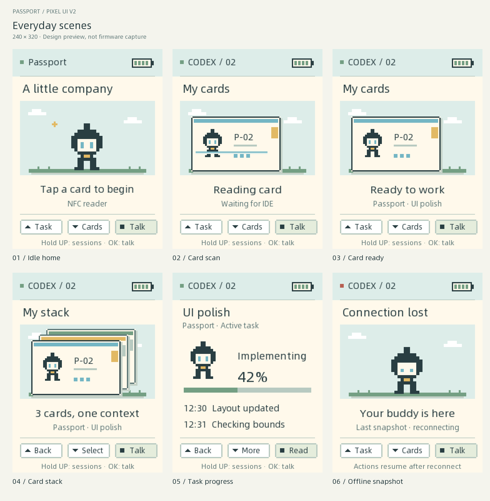
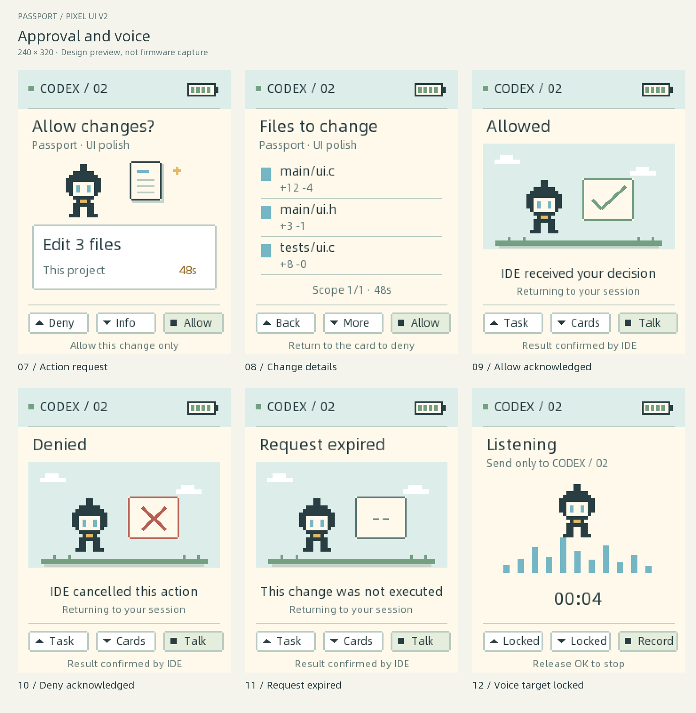
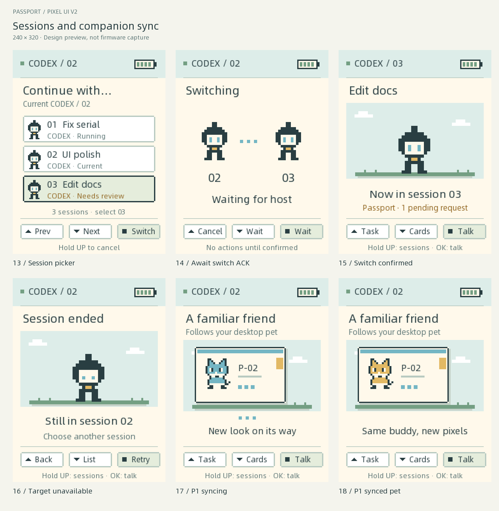
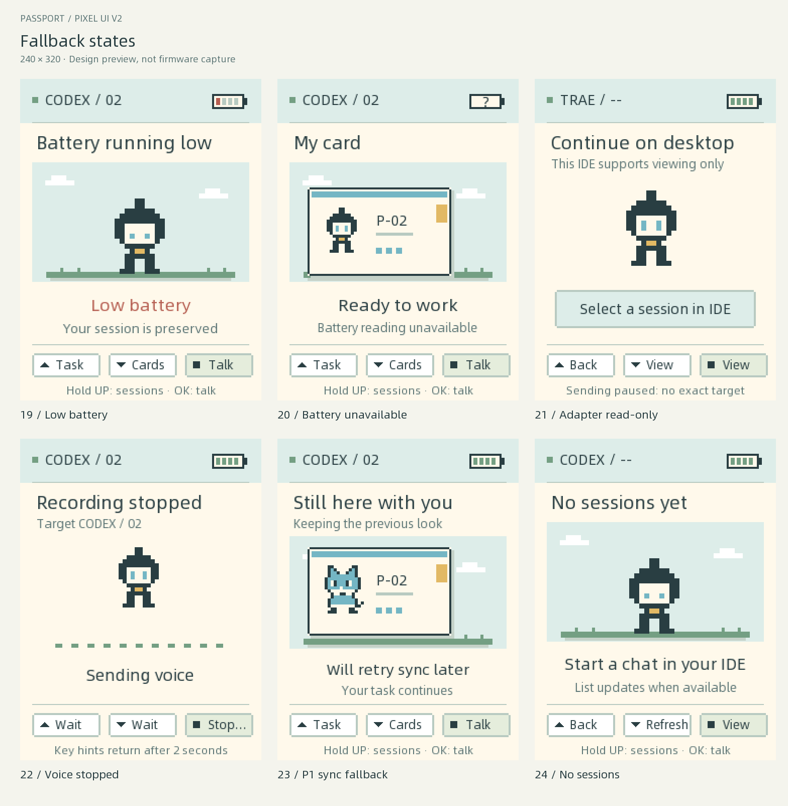
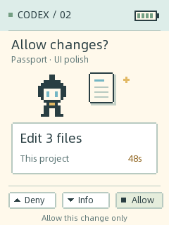
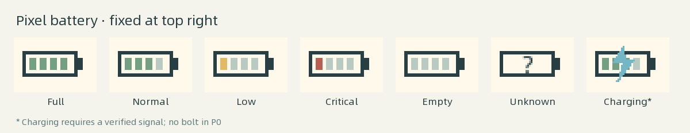
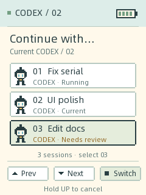
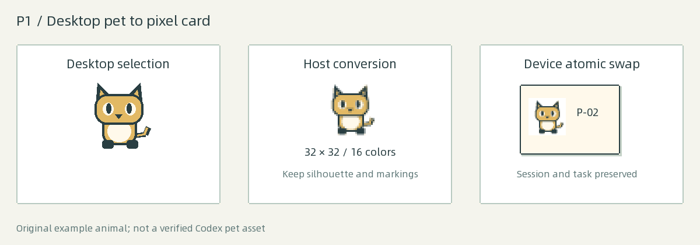

<p align="right">
  <a href="passport-pixel-ui-design.zh_CN.md">简体中文</a> · <strong>English</strong>
</p>

# Passport pixel companion design

Version: v2, 2026-09-18. Status: **implemented; device verification pending**.

This is the current design source for Passport's visual experience. It refines
the earlier [Physical Skills design](physical-skills-mvp-design.md). The existing
firmware has a pixel robot, card scanning, up to four overlapping tiles,
graphical battery, operation-card approvals, multiple-session routing, voice
feedback and automatic companion transfer.

All images are original, reproducible design previews at 240 × 320, enlarged
with nearest-neighbor scaling. They are not device screenshots. Names, file
counts, progress and pets are illustrative; the sample animals are not official
Codex assets. The English and Chinese editions have matching image sets.

## What changes

| Priority | Change | User outcome |
| --- | --- | --- |
| P0 | Companion presents an action card | Understand the operation, scope and requesting session before deciding |
| P0 | Segmented pixel battery | Read the battery at a glance without a permanent percentage label |
| P0 | Explicit IDE session selection | Keep task state, voice and approvals attached to the selected session |
| P1 | Follow the desktop companion | Changing the PC pet updates the pet inside the current Passport card |

P0 includes the real host routing work required by the screens. Drawing a
session picker alone does not deliver session switching. P1 starts with
verifying the desktop pet source, then conversion, delivery and atomic swap.

## Complete screen gallery

Each panel represents a complete screen, including the status header and
physical-button legend. The gallery covers 24 states.



01 idle, 02 NFC scanning, 03 single card ready, 04 composed stack, 05 task
progress, 06 offline snapshot.



07 approval card, 08 change details, 09 allow acknowledged, 10 deny acknowledged,
11 expired request, 12 voice recording with a fixed target.



13 session picker, 14 switching, 15 confirmed destination, 16 unavailable
destination, 17 P1 pet transfer, 18 P1 updated pet.



19 low battery, 20 unavailable battery reading, 21 adapter without exact session
routing, 22 recording stopped, 23 pet-sync fallback, 24 no available sessions.

Individual PNGs are in [the image directory](../../assets/images/passport-ui-v2/).
For close inspection: [approval](../../assets/images/passport-ui-v2/07-approval.en.png),
[session picker](../../assets/images/passport-ui-v2/13-sessions.en.png),
[pet card](../../assets/images/passport-ui-v2/18-pet-synced.en.png).

## Visual system

The companion and the card are the main subjects. Status text supports the
illustration; detailed logs and file lists open on separate pages.

| Element | Specification |
| --- | --- |
| Display | 240 × 320 portrait; RGB565 output; no touch |
| Header | y=0–43; connection mark, IDE/session label, battery at right |
| Main area | y=44–263; 16 px horizontal content margin |
| Footer | y=264–319; three button cells and one gesture hint |
| Colors | Paper `#FFF9EB`, ink `#293E42`, sky `#DDEDE9`, blue `#74B6C4`, green `#749F83`, amber `#E2B964`, red `#B65F52` |
| Geometry | Pixel-aligned rectangles, 2 px outlines, 3 px hard shadows, stepped corners |
| Type | Primary copy 18 px, action/summary 16 px, secondary 12–14 px, hints 11–12 px; readable CJK font |
| Sprites | Default robot; P1 pet uses a 32 × 32 source rendered at integer scale |
| Motion | 100 ms scene tick; short slide/scan, two-pixel breathing; no full-screen flashes |

Small labels may ellipsize at a UTF-8 boundary. Approval scope must remain
available through paginated details; a truncated title is never the only source
for an authorization decision. Color always has a second cue: shape, label,
selection border or battery fill.

## Approval becomes an operation card



Replace the large yellow rectangle with a cream scene. The companion stands
beside a document or terminal icon. The title asks about the actual action;
the white card states its scope. The IDE/session remains visible in the header.

| Situation | Main copy | Evidence and action |
| --- | --- | --- |
| Structured file edit | “Allow changes?” / “Edit 3 files” | Project, actual file count, remaining time; Down opens all file paths |
| Structured command | “Run this command?” | Command icon and exact command/cwd in details; no invented risk rating |
| Only legacy summary available | “Review request” | Render the original summary; omit fabricated file counts and scope |
| Allow/deny sent | “Sending decision” | Freeze buttons; retain the same request identity |
| IDE acknowledges allow | “Allowed” | Brief green check, then return; does not mean the file write succeeded |
| IDE acknowledges deny | “Denied” | Brief cross icon, then return |
| Request expires or is withdrawn | “Request expired” | Disable actions and return; never infer execution success |
| Device disconnects before ACK | “Decision unconfirmed” | Reconcile request status on reconnect; no positive receipt animation |

The preview's “This project” scope is conditional on a complete, host-verified
scope. If the command or affected paths cannot be represented faithfully, offer
denial and “Continue on desktop”; do not present a shortened approval as a full
review. Long paths are paginated and numbered. The desktop remains available
for reviewing the full diff.

**Gestures:** Up denies on the operation card, Down opens details, OK allows
only this request. In details, Up returns, Down advances, OK allows. No
session-wide grant. Disable voice-start and session-switch gestures throughout
approval; consume the release after a long gesture so it cannot also approve.
New requests become actionable only after all buttons are released.

The companion looks attentive and does not celebrate before the decision.
Amber marks a pending choice, red marks failure/denial, and green appears only
after a host receipt. Approval timeout remains 60 s; showing details does not
reset it. Host expiry takes precedence. Countdown seconds may update at 1 Hz.

The expired preview assumes the host confirms expiry before accepting any
decision. Once a decision has been sent, an absent receipt must use
“Decision unconfirmed”; it cannot claim the modification was not executed.

A background session's request adds a pending badge to the session picker and
does not replace the foreground request. Requests are keyed by bridge, session
and request ID. The host queues additional requests; only one complete approval
is held on-device. Closing a request reveals the next request for that same
selected session.

## Battery becomes a pixel icon



Use a 32 × 15 outlined battery with a 3 px terminal and four fill segments.
Place it at x=191, y=15. Remove the permanent numeric percentage from the header.
The icon remains visible during approval, voice, card scanning and switching.

| Reading | Drawing |
| --- | --- |
| 1–100% | `ceil(SOC / 25)` segments, capped at four |
| 21–100% | Green fill |
| 11–20% | Amber fill |
| 1–10% | Red fill plus one low-battery notice |
| 0% | Empty outline plus low-battery notice |
| Unavailable (`-1`) | Question mark inside; never masquerades as 0% |
| Charging | Lightning only after a verified charging signal is exposed |

Refresh SOC at 1 Hz through the existing battery path. A low-battery notice
appears once per crossing into <=10%, yields to approval/recording and re-arms
only after recovery above 15%. It does not stop a session or start a new power
policy. A single read failure shows unknown immediately and recovers on the next
valid reading.

The [current battery API](../../components/bsp/include/bsp_battery.h) reports SOC
and voltage, not charging status. USB connection is not evidence of charging.
The charging state in the strip is reserved; P0 ships without a lightning bolt.

## Multiple IDE sessions



**A physical card stack selects context; the session picker selects the
conversation receiving actions.** These are separate counts and identities.
Three tiles do not imply three sessions. Switching a session never reorders
tiles, creates a conversation or restarts another session's work.

Hold Up from home, stack or task pages to open the picker. Use the existing BSP
long-press event; its duration follows the board configuration. Up/Down move
the selection, OK requests a switch, hold Up cancels. The current row has a
“Current” marker; the candidate row has a dark border. Three rows are visible.
Long lists page on demand and retain stable order while the picker is open.

Each row shows IDE, project/title, a short display number and a state
(running, idle, pending, ended or read-only). Short numbers are for display
only. The host routes using an opaque, collision-free key mapped to the full
native session/thread ID and bridge instance. Duplicate titles remain distinct.
The list contains only sessions compatible with the currently bound context;
unmatched sessions require an explicit rebind on the PC.

### Switching transaction

1. Capture the candidate key and send a select request with a transaction ID.
2. Display “Switching”; freeze outgoing voice and task actions. Keep the old
   session label until a matching host confirmation arrives.
3. On confirmation, replace the session snapshot together: task, progress,
   events, pending approval and companion binding. Then update the header.
4. If the host rejects an ended/unavailable target, remain on the old session
   and refresh the list.
5. After 5 s without confirmation, show an unconfirmed state and query the
   authoritative selection. Keep writes disabled until reconciled; a timeout
   alone does not prove the host stayed on the old session.

Cancellation invalidates the outstanding transaction and asks the host to
cancel/reconcile it. Late confirmations cannot overwrite a newer selection.
Each accepted selection advances `route_epoch`; stale events and actions are
rejected. PC window focus does not automatically change the device's selection.
An explicit PC “Send to Passport” action may propose a switch through the same
transaction, but cannot preempt active recording or approval.

### Session isolation

| Event | Rule |
| --- | --- |
| Task/event from selected session | Update that session's snapshot |
| Task/event from another session | Update its host cache and list badge |
| Voice starts | Capture the selected route and epoch for the whole utterance |
| Voice target ends | Stop/reject delivery with an explicit result; never redirect it |
| Approval arrives elsewhere | Badge only; user selects that session to review |
| Bridge reconnects | Fetch selection and snapshot; freeze actions until complete |
| Card context changes | Verify compatibility; pause actions and ask for selection if ambiguous |
| No sessions | Empty state with Refresh; no hidden session creation |
| Adapter cannot target exact sessions | Read-only view and a desktop continuation hint |

The [Codex adapter](../../tools/codex_adapter.py) uses the Codex app-server
`thread/list`, `thread/read`, `thread/resume` and `turn/start` APIs for exact
session catalogs and routing. Its protocol-1 MCP path remains for compatibility.
The [Trae adapter](../../tools/trae_adapter.py) currently reports a synthetic
session ID and launches a CLI; it cannot prove exact existing-chat routing.
These are current implementation facts, not claims about all IDE versions.
Capability negotiation must hide or disable unsupported operations. Never
present a synthetic ID as a routable native conversation.

## P1: follow the companion selected on the PC



When the selected session's IDE profile changes its companion, update the
companion inside the current card automatically. Preserve recognizable
silhouette, palette and markings. A new pet skin does not change the card ID,
tile order, active session, approval or task.

The user changes pets only in the PC IDE. Passport observes that selection
through the host adapter and receives the new revision during a later idle
communication cycle. There is no device-side change-pet button, manual sync
button, upload command or additional user confirmation.

Binding order: explicit session companion, then the IDE profile's companion,
then the built-in robot. Profiles and IDE instances are isolated; changing a
different profile's pet must not update this card. All agent tiles bound to
the same profile use the same revision; project/review/skill tiles keep their
role symbols. Transfer only the foreground pet; background ones are cached on
the host until needed.

### Detect and convert on the host

Prefer an official extension/API event containing the selected pet ID,
revision and usable asset. A verified, versioned local configuration/asset
reader is the fallback, operating only on the selected profile's known paths.
Do not infer the pet from window screenshots or scrape undocumented paths
without an adapter contract. The Codex adapter reads the verified
`selected-avatar-id` key from `~/.codex/config.toml`, then resolves `pet.json`
and the versioned spritesheet inside `~/.codex/pets/`; it never writes those
files. A missing selection, unknown atlas version or unavailable decoder keeps
the previous device asset. The converter uses Pillow when available on the
Bridge host; firmware builds do not depend on it.

Debounce rapid changes for 500 ms; keep only the latest revision. Convert
locally: decode and orient, preserve alpha, crop to the subject, letterbox
without stretching, reduce to a 32 × 32 canvas, quantize to 16 shared colors
including a transparent index, then preserve an ink outline where needed.
For complex opaque artwork, verified segmentation may be necessary; if no
reliable subject can be extracted, retain the previous pet. Do not replace an
unrecognized pet with a random lookalike.

Existing pixel assets use nearest-neighbor resampling. Smooth artwork uses
area reduction before palette quantization; drawing at 2× or 3× uses nearest
neighbor. A geometric pixel conversion is the P1 baseline, not a generative
model dependency. Test silhouette/marking fidelity before enabling automatic
conversion for a source family.

Use one static frame by default. Up to four source animation frames may share
the palette; a static source may receive a simple position-based breathing
motion without changing its identity. Host cache key:
`source_asset_hash + conversion_version + palette_version`.

### Transfer and swap

One 32 × 32 indexed frame costs 512 bytes at 4 bpp. A palette is 32 bytes
(RGB565, index 0 reserved for transparency). Four frames plus palette cost
2,080 bytes; two slots cost 4,160 bytes before metadata. Budget <=8 KiB of
additional application RAM, separate from LVGL's pool; verify peak use during
recording. Draw indexed runs directly, without a full RGB framebuffer.

Send metadata first and <=128 raw bytes per base64 chunk. Include asset hash,
byte offset, total bytes and a transfer ID. Enforce the existing 512-byte line
limit after UTF-8 serialization. USB serial parsing stays with the single
reader; a worker validates assets. Recording and approvals take transport
priority; pet transfer pauses and resumes by acknowledged offset.

The inactive RAM slot receives the complete asset. Validate dimensions, byte
count, palette, frame count and content hash before publishing. Swap the slot
under the LVGL lock at a frame boundary. If the user changes pet again, abandon
the older transfer. Keep the previous pet on decode failure, missing chunks,
disconnect or stale revision. Show a brief sync hint, never a blank card.

P1 stores the device cache in RAM and the reusable cache on the PC. After
reboot, show the built-in robot until resynchronization. No new Flash partition
or large NVS blob is required.

## Protocol and implementation boundary

These messages are implemented by the firmware and Codex Bridge. Their
normative field and transaction rules are in the
[v2 wire contract](passport-v2-protocol.md); capability negotiation remains
mandatory.

| Family | Data | Owner |
| --- | --- | --- |
| `session.catalog` / `session.entry` | Transaction, page, three bounded entries and stable selection key | Host registry |
| `session.select` / `session.selected` / `session.query` | Transaction, opaque session key, bridge instance, route epoch, result | Bridge and device |
| Routed task/voice/approval | Session key, route epoch; request/utterance ID where applicable | Both |
| `approval.request` extension | Operation, verified scope, detail pages, expiry, summary, request revision | IDE adapter |
| `approval.receipt` | Decision accepted/denied/expired/unknown, original request identity | IDE adapter |
| `companion.begin/chunk/ack/commit` | Source revision, transfer ID, dimensions, offset, hash and format | Host converter/device cache |

Keep catalog pages and detail records in separate bounded lines; never send
an unbounded JSON array. The firmware retains only the current session
snapshot, three catalog rows and one approval; the host owns the remaining
history and pagination. P0 session metadata budget is <=4 KiB additional
application RAM, to be verified with the 24 KiB LVGL pool and active audio.

Old clients stay in explicit single-session mode. If protocol capabilities
cannot guarantee routing, disable the multi-session action path. During
migration, both endpoints must agree on the route envelope before accepting
decisions or voice frames.

## Input and motion rules

| Page/state | Up | Down | OK | Long gesture |
| --- | --- | --- | --- | --- |
| Home | Task page | Card stack | No send | Up: sessions; OK: record |
| Stack | Home | Next tile | No send | Up: sessions; OK: record |
| Task | Home | Next event page | Acknowledge event | Up: sessions; OK: record |
| Session picker | Previous | Next | Request switch | Up: cancel |
| Switching/unconfirmed | Cancel/reconcile | Disabled | Disabled | Recording disabled |
| Approval card | Deny | Details | Allow once | Voice/session gestures disabled |
| Approval details | Card | Next page | Allow once | Voice/session gestures disabled |
| Recording | Disabled | Disabled | Release stops | No session switching |

Input dispatch gives approval priority, then recording, then switching, then
navigation. Release-to-stop remains immediate. A stopped-recording surface
lasts 2 s, regardless of transcription duration; afterward any outstanding
delivery state appears as a small task status.

| Motion | Timing and completion |
| --- | --- |
| Single card | Scan/entry then prominent hold, 3,200 ms total; card remains afterward |
| Multi-card change | 1,400 ms, 120 ms stagger; maximum four physical layers |
| Unchanged NFC/stack event | No animation restart |
| Remove and re-add | Re-arm the card entry |
| Covered scene | Pause decorative time; retain the newest state |
| Allow/deny acknowledgement | 1,200 ms receipt animation; host execution remains separate |
| Session switch | Short transition after ACK; never an optimistic route change |
| Pet replacement | 200 ms two-frame reveal after validation; defer behind approval/voice |

Pending IDE work stays pending after the scan. The status never becomes ready
because a timer elapsed. Real task percentages come only from host task data.

## Delivery and acceptance

P0 and the one-frame P1 baseline are implemented. Remaining acceptance work is
physical display/button inspection, real approval traffic, active recording
while switching is attempted, and peak-RAM measurement on the target board.

| Check | Acceptance |
| --- | --- |
| Approval readability | Action, session and scope visible; details complete; no long-press release accidentally approves |
| Battery | 0, 1, 10, 11, 20, 21, 25, 26, 100 and unavailable map correctly; USB alone never draws charging |
| Three same-IDE sessions | Display selection matches voice/event/approval routing; duplicate titles do not collide |
| Background approval | Badge appears without replacing the foreground operation |
| Switch failure/race | Ended target, stale ACK, timeout, cancellation and reconnect never misroute an action |
| Recording | Target captured once; physical release stops; 2 s completion hint preserved |
| Pet change | Selected profile's latest asset appears; other profiles do not alter the card |
| Pet failure | Corrupt, oversized, incomplete and stale transfers preserve the previous pet |
| Memory | Host tests plus on-device peak RAM with four tiles, recording and transfer active |
| Display | Inspect 240 × 320 at native scale for clipping, glyph coverage, contrast and button legibility |

Previews can be regenerated with Pillow and the existing font source:

```bash
python3 tools/render_passport_design.py --sample
python3 tools/render_passport_design.py
```

The renderer checks text and shape bounds and emits a
[manifest](../../assets/images/passport-ui-v2/manifest.json). Preview text uses
the full source font; shipping firmware must regenerate and validate its CJK
subset. Repository checks validate document links and language pairs.
Firmware compilation does not establish physical display correctness. Any
later physical flash requires
`./tools/validate.sh --preflash`.
