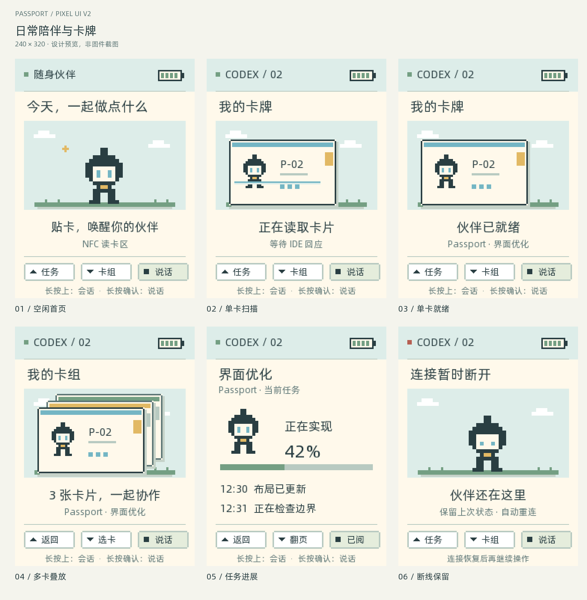
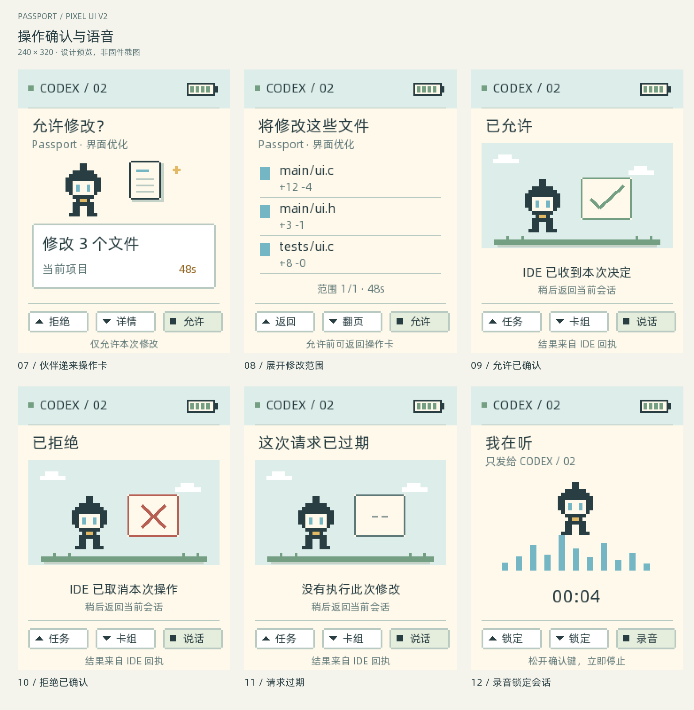
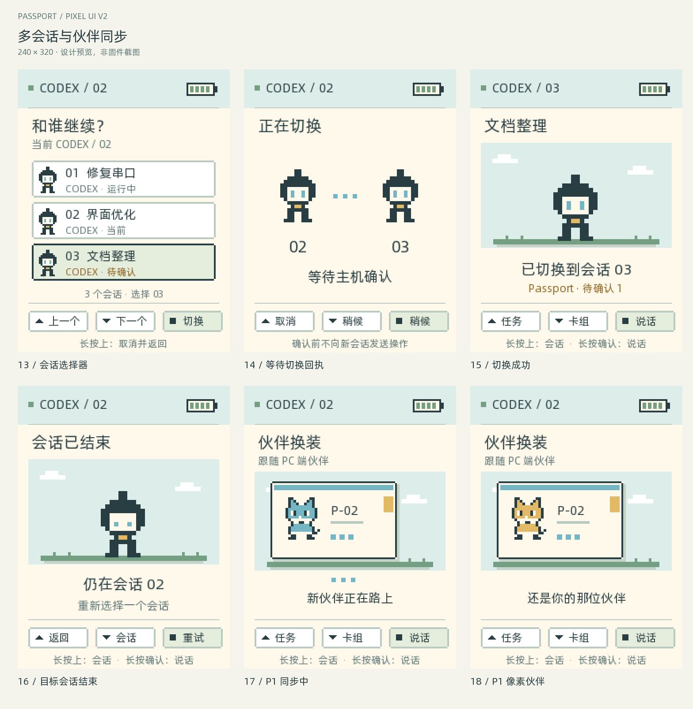
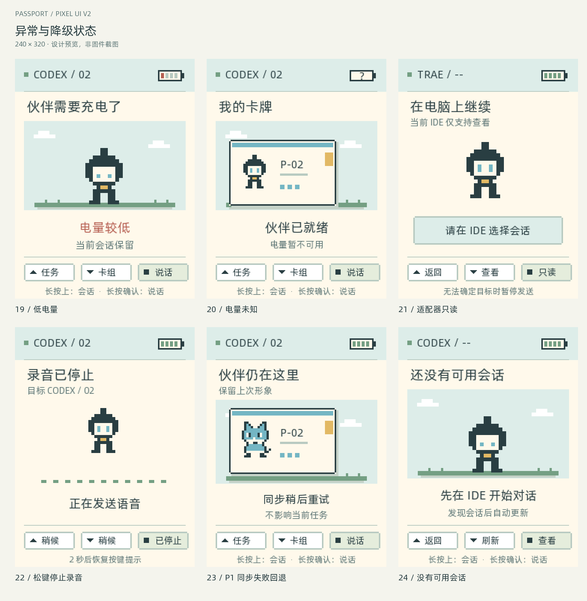
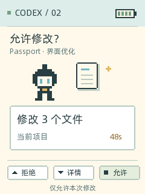
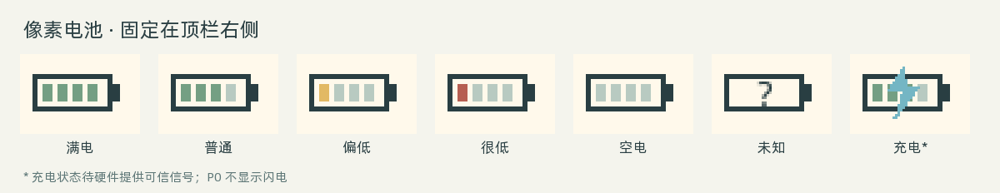
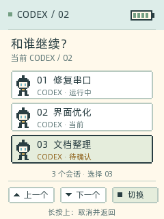
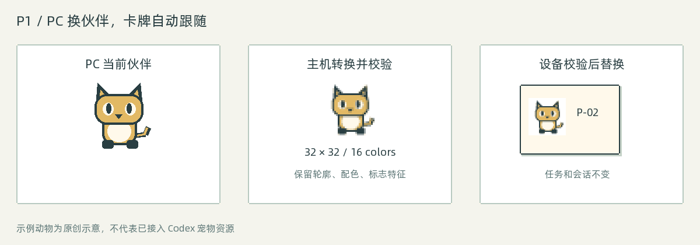

<p align="right">
  <strong>简体中文</strong> · <a href="passport-pixel-ui-design.md">English</a>
</p>

# Passport 像素伙伴界面设计

版本：v2，2026-09-18。状态：**已实现，待实机验证**。

本文是 Passport 视觉体验的当前设计依据，承接并更新此前的
[Physical Skills 设计](physical-skills-mvp-design.zh_CN.md)。当前固件已具备像素机器人、
贴卡扫描、最多四张贴片叠放、图形电量、操作确认卡、多会话路由、录音反馈和
自动伙伴传输。

所有图片均为可复现的原创设计预览，以 240 × 320 绘制，再按整数倍放大，
**不是实机截图**。会话名称、文件数、进度和宠物均为示例；示例动物不是 Codex
官方宠物资源。中英文文档分别配有对应语言的图片。

## 本轮改动

| 优先级 | 改动 | 用户得到什么 |
| --- | --- | --- |
| P0 | 伙伴递来操作卡 | 决定之前看清要做什么、影响范围，以及来自哪个会话 |
| P0 | 分格像素电池 | 一眼看懂电量，顶栏不再常驻百分比文字 |
| P0 | 显式选择 IDE 会话 | 任务、语音和审批始终属于选中的会话 |
| P1 | 跟随 PC 端伙伴 | 电脑上更换宠物，当前卡牌中的伙伴自动更新 |

P0 包含界面背后必要的主机会话路由，只有会话列表画面还不能算切换完成。
P1 先验证桌面宠物的读取来源，再实现转换、传输和完整替换。

## 完整界面预览

每个画面都包含顶栏和实体按键提示，共覆盖 24 个状态。



01 空闲首页，02 NFC 扫描，03 单卡就绪，04 多卡组合，05 任务进展，
06 断线时保留上次状态。



07 操作确认卡，08 修改范围详情，09 允许回执，10 拒绝回执，
11 请求过期，12 锁定目标会话的录音状态。



13 会话选择器，14 等待切换回执，15 切换成功，16 目标会话不可用，
17 P1 宠物传输中，18 P1 宠物更新完成。



19 低电量，20 无法读取电量，21 适配器不能精确路由会话，
22 松键后录音停止，23 宠物同步失败回退，24 没有可用会话。

单张 PNG 位于[图片目录](../../assets/images/passport-ui-v2/)。
可单独查看[审批页](../../assets/images/passport-ui-v2/07-approval.zh.png)、
[会话选择页](../../assets/images/passport-ui-v2/13-sessions.zh.png)、
[宠物卡牌](../../assets/images/passport-ui-v2/18-pet-synced.zh.png)。

## 视觉规范

伙伴和卡牌是画面主体。状态文字解释当前发生的事，日志、文件清单放到独立详情页。

| 元素 | 规格 |
| --- | --- |
| 屏幕 | 240 × 320 竖屏，RGB565 输出，无触摸 |
| 顶栏 | y=0–43，连接标记、IDE/会话标签、右侧电池 |
| 主内容 | y=44–263，左右内容边距 16 px |
| 操作区 | y=264–319，三个按键格和一行手势提示 |
| 配色 | 奶油底 `#FFF9EB`，墨色 `#293E42`，天空 `#DDEDE9`，蓝 `#74B6C4`，绿 `#749F83`，琥珀 `#E2B964`，红 `#B65F52` |
| 几何 | 整像素矩形、2 px 轮廓、3 px 硬阴影、阶梯切角 |
| 字级 | 主标题 18 px，动作与摘要 16 px，辅助信息 12–14 px，提示 11–12 px；中文优先保证可读 |
| 精灵 | 默认机器人；P1 宠物用 32 × 32 源图，按整数倍显示 |
| 动效 | 场景 100 ms 刷新；短滑入、扫描、上下 2 px 呼吸；不做全屏闪烁 |

短标签可在 UTF-8 字符边界省略。审批范围必须能在分页详情中完整查看，不能仅凭
被截断的标题批准操作。颜色必须配合形状、文字、选中边框或电池填充表达状态。

## 审批改为操作卡



移除大面积黄色矩形，改用奶油底。伙伴站在文件或终端图标旁，标题直接询问本次
动作，白色卡片写明范围。顶栏始终保留发起请求的 IDE 和会话。

| 情况 | 主要文案 | 信息与操作 |
| --- | --- | --- |
| 结构化文件修改 | “允许修改？”／“修改 3 个文件” | 项目、真实文件数、剩余时间；下键查看完整路径 |
| 结构化命令执行 | “运行这个命令？” | 终端图标，详情展示原始命令及工作目录，不编造风险等级 |
| 只有旧版摘要 | “需要确认” | 展示原摘要，不推测文件数和修改范围 |
| 允许或拒绝已发出 | “正在发送决定” | 暂停重复操作，保持原请求身份 |
| IDE 确认收到允许 | “已允许” | 短暂绿色勾后返回，不表示文件已经修改成功 |
| IDE 确认拒绝 | “已拒绝” | 短暂叉号后返回 |
| 请求过期或被撤回 | “这次请求已过期” | 禁用操作后返回，不推测执行结果 |
| 收到回执前断线 | “决定尚未确认” | 重连后查询请求状态，不播放成功回执 |

预览中的“当前项目”只在主机提供完整、可信的范围时显示。如果无法忠实呈现命令
或受影响路径，设备保留拒绝和“在电脑上处理”入口，不将缩略审批当作完整审阅。
长路径分段分页并显示页码，完整 diff 仍可在电脑上查看。

**按键：**操作卡中，上键拒绝，下键查看详情，确认键只允许本次请求。详情页中，
上键返回，下键翻页，确认键允许。不提供“整个会话始终允许”。审批期间禁用
录音启动和会话切换手势；长按后的松键不能再触发一次允许。
新请求必须等所有按键松开后才接受决定。

伙伴呈现等待回应的姿态，决定前不庆祝。琥珀色表示待决定，红色表示失败或拒绝，
绿色仅在收到回执后出现。审批超时仍为 60 秒，打开详情不重置计时，
主机撤回或过期状态优先。倒计时每秒更新一次即可。

过期预览假定主机确认请求在接受决定前已过期。一旦决定已经发出，缺少回执时
必须显示“决定尚未确认”，不能声称此次修改没有执行。

后台会话的请求只增加会话列表中的待确认标记，不覆盖前台请求。请求以 Bridge、
会话和请求 ID 联合定位。主机排队保存额外请求，设备一次只保存一个完整审批。
当前请求结束后，再展示同一选中会话的下一条请求。

## 电量改为像素图标



电池主体为 32 × 15，右侧凸出 3 px 电极，内部四格填充，放在 x=191、y=15。
顶栏取消常驻百分比。审批、录音、贴卡和切换会话时都保留图标。

| 读数 | 绘制规则 |
| --- | --- |
| 1–100% | `ceil(SOC / 25)` 格，最多四格 |
| 21–100% | 绿色填充 |
| 11–20% | 琥珀色填充 |
| 1–10% | 红色填充，补一次低电量提示 |
| 0% | 空电池轮廓，补低电量提示 |
| 不可用（`-1`） | 轮廓内显示问号，不能当作 0% |
| 充电 | 仅在硬件提供可信充电信号后叠加闪电 |

沿用现有电池读取路径，每秒刷新。进入 ≤10% 时提示一次，提示让位于审批和录音；
回升到 >15% 后才允许再次触发。提示不停止会话，也不引入新的省电策略。
一次读取失败就显示未知，下次有效读数到来后恢复。

[当前电池 API](../../components/bsp/include/bsp_battery.h) 只有电量和电压，没有充电
状态。USB 已连接不能作为正在充电的依据。图中的充电态为预留设计，P0 不显示闪电。

## IDE 多会话切换



**实体卡组决定上下文，会话选择器决定操作发给哪段对话。**两者的数量和身份
彼此独立。三张贴片不代表三个会话，切换会话不重新排序卡组、不新建对话，也不
重启其他会话的任务。

首页、卡组页和任务页长按上键进入选择器，复用 BSP 的长按事件，时长沿用板级
配置。上／下键移动，确认键请求切换，长按上键取消。当前会话标注“当前”，
候选行显示深色边框。一次展示三行，更多会话按需翻页，打开列表期间保持稳定排序。

每行展示 IDE、项目／标题、显示用短编号和状态：运行中、空闲、待确认、已结束、
只读。短编号仅供显示；主机以无碰撞的不透明键路由，映射到完整原生 session/thread
ID 和 Bridge 实例。同名会话也必须可区分。列表只纳入与当前绑定上下文兼容的
会话，不兼容的会话需要先在 PC 显式重新绑定。

### 切换事务

1. 记录候选会话键，带事务 ID 发送切换请求。
2. 显示“正在切换”，暂停发送语音和任务操作。匹配的主机确认到来前，顶栏保留
   旧会话标签。
3. 主机确认后，整体替换任务、进度、事件、待审批和伙伴绑定，再更新顶栏。
4. 主机拒绝已结束或不可用的目标时，保留旧会话并刷新列表。
5. 5 秒内没有确认，显示未确认状态并查询主机的实际选择；核对完成前保持禁用
   写操作。超时本身不能证明主机仍停在旧会话。

取消操作会使当前事务失效，并要求主机取消或核对状态。迟到的回执不能覆盖较新的
选择。每次确认切换递增 `route_epoch`，拒绝旧代次的事件和操作。
PC 窗口焦点变化不自动切换设备会话。PC 上显式的“发送到 Passport”可以走同一
事务提出切换，但不能抢占正在录音或正在处理的审批。

### 会话隔离

| 事件 | 处理规则 |
| --- | --- |
| 当前会话的任务或事件 | 更新该会话快照 |
| 其他会话的任务或事件 | 更新主机缓存和列表标记 |
| 开始录音 | 固定整段录音的路由目标和代次 |
| 录音目标结束 | 停止或拒绝投递并明确反馈，不改投其他会话 |
| 其他会话有审批 | 只标记，用户选择该会话后再处理 |
| Bridge 重连 | 拉取选择和快照，完整恢复前暂停操作 |
| 实体卡组变化 | 检查上下文兼容性，有歧义就暂停发送并要求选择 |
| 没有会话 | 显示空态和刷新入口，不在后台新建对话 |
| 适配器不能精确指定会话 | 只读展示，提示回到电脑继续 |

[Codex 适配器](../../tools/codex_adapter.py) 已通过 Codex app-server 的
`thread/list`、`thread/read`、`thread/resume` 和 `turn/start` 实现精确会话目录
与路由；protocol-1 MCP 路径继续用于兼容。
[现有 Trae 适配器](../../tools/trae_adapter.py) 返回的是合成 session ID，
通过 CLI 唤起对话，不能证明可精确路由到指定的已有聊天。
这是当前仓库实现的边界，不代表所有 IDE 版本的能力。界面应通过能力协商隐藏
或禁用不支持的操作，不能把合成 ID 伪装成可路由的原生会话。

## P1：跟随 PC 端选择的伙伴



选中会话所属的 IDE 配置更换伙伴后，自动更新当前卡牌里的伙伴，保留可辨认的
轮廓、主色和标志特征。换形象不改变卡片 ID、贴片顺序、活动会话、审批或任务。

用户只在 PC 的 IDE 中换宠。主机适配器感知选择变化后，在后续一次空闲通信中
把新版本同步给 Passport。设备不提供换宠按钮、手动同步按钮或上传命令，
也不要求用户再次确认。

绑定优先级：会话明确指定的伙伴 → IDE 配置中的伙伴 → 内置机器人。
不同配置和 IDE 实例彼此隔离，其他配置换宠物不能改动当前卡牌。同一配置绑定的
主体卡使用相同资源版本；项目、审查、技能卡保留角色符号。设备只传输当前前台
伙伴，后台伙伴先缓存在主机，切换时再按需加载。

### 在主机发现并转换

优先使用官方扩展或 API 事件，取得选中宠物 ID、版本和可使用的资源。
备选是经过验证、带版本适配的本地配置和资源读取器，仅访问当前配置已知的路径。
不靠窗口截图猜测宠物，也不在没有适配契约时抓取未确认的内部路径。
Codex 适配器读取已验证的 `~/.codex/config.toml` 中 `selected-avatar-id`，
再解析 `~/.codex/pets/` 下对应的 `pet.json` 和版本化图集，全程只读。
选择键缺失、图集版本未知或解码器不可用时保留设备上的旧伙伴。转换器在 Bridge
主机可用时使用 Pillow，固件构建本身不依赖 Pillow。

快速换宠物时做 500 ms 防抖，只处理最新版本。主机本地完成解码与方向修正、
保留透明通道、裁剪主体、等比留边缩到 32 × 32、量化为含透明索引的 16 色，
必要时补齐墨色轮廓。复杂的不透明原图可能需要可靠的主体分割；无法提取时
保留上次形象，不随机换成外观近似的另一只宠物。

原始像素图使用最近邻缩放。平滑图先用区域采样缩小，再量化调色板；显示放大
2 倍或 3 倍时使用最近邻。P1 基线采用确定性的像素转换，不依赖生成模型。
某类来源开放自动转换前，需要先验证轮廓和特征保真度。

默认只用一张静态帧。最多从原动画取四帧并共用调色板；静态素材可增加简单的
位置呼吸动效，不改变宠物身份。主机缓存键为：
`source_asset_hash + conversion_version + palette_version`。

### 传输和替换

32 × 32、4 bpp 索引图每帧 512 字节，RGB565 调色板 32 字节，索引 0 代表透明。
四帧加调色板为 2,080 字节，两份槽位共 4,160 字节，另加元数据。
新增应用 RAM 预算 ≤8 KiB，与 LVGL 内存池分开核算，并在录音期间测量峰值。
绘制时按索引色连续段输出，不申请整屏 RGB 帧缓冲。

先发送元数据，每个 base64 分块最多承载 128 字节原始数据，带资源 hash、偏移、
总长度和传输 ID。按最终 UTF-8 序列化结果检查现有 512 字节行长上限。
串口继续由唯一 reader 读取，worker 校验资源。录音和审批优先占用传输，
宠物传输暂停后按已确认偏移续传。

完整数据进入非活动 RAM 槽位，检查尺寸、字节数、调色板、帧数和内容 hash 后才
发布，在 LVGL 锁内于帧边界切换。如果用户又换了一次宠物，就废弃旧传输。
解码失败、缺块、断线或收到旧版本时保留上次伙伴，只显示短暂同步提示，不出现
空白卡牌。

P1 在设备用 RAM 缓存，在 PC 保存可复用缓存。设备重启后先显示内置机器人，
同步完成再替换，不新增 Flash 分区，也不把大资源写进 NVS。

## 协议与开发边界

以下消息已由固件和 Codex Bridge 实现；字段和事务规则以
[v2 通信契约](passport-v2-protocol.zh_CN.md)为准，仍须先完成能力协商。

| 消息族 | 数据 | 归属 |
| --- | --- | --- |
| `session.catalog` / `session.entry` | 事务、分页、三条有界记录、稳定选择键 | 主机会话目录 |
| `session.select` / `session.selected` / `session.query` | 事务、不透明会话键、Bridge 实例、路由代次和结果 | Bridge 与设备 |
| 带路由的 task/voice/approval | 会话键、路由代次，必要的请求或录音 ID | 双端 |
| `approval.request` 扩展 | 操作类型、可信范围、详情分页、过期时间、摘要和请求版本 | IDE 适配器 |
| `approval.receipt` | 决定已接受／拒绝／过期／未知，以及原请求身份 | IDE 适配器 |
| `companion.begin/chunk/ack/commit` | 源版本、传输 ID、尺寸、偏移、hash 和格式 | 主机转换器／设备缓存 |

会话目录页和详情记录分行发送，每行独立限长，不发送无界 JSON 数组。
固件只保留当前会话快照、三条目录记录和一份审批，历史与分页由主机保存。
P0 会话元数据新增应用 RAM 预算 ≤4 KiB，需与 24 KiB LVGL 池、活动录音一起验证。

旧端维持明确的单会话模式。能力协商不能保证路由时，禁用多会话操作。
迁移阶段只有双端都认可路由 envelope 后，才能接受审批决定或语音帧。

## 按键和动效规则

| 页面／状态 | 上键 | 下键 | 确认键 | 长按 |
| --- | --- | --- | --- | --- |
| 首页 | 任务页 | 卡组页 | 不发送 | 上：会话；确认：录音 |
| 卡组 | 首页 | 下一张 | 不发送 | 上：会话；确认：录音 |
| 任务 | 首页 | 下一页事件 | 确认已阅 | 上：会话；确认：录音 |
| 会话选择 | 上一条 | 下一条 | 请求切换 | 上：取消 |
| 切换中／未确认 | 取消并核对状态 | 禁用 | 禁用 | 禁止启动录音 |
| 操作卡 | 拒绝 | 详情 | 允许本次 | 禁用录音和会话手势 |
| 操作详情 | 返回操作卡 | 下一页 | 允许本次 | 禁用录音和会话手势 |
| 录音中 | 禁用 | 禁用 | 松开即停 | 不可切换会话 |

输入分发优先级为审批、录音、切换事务、普通导航。松键立即停止录音。
停止录音的提示持续 2 秒，不随转写耗时延长；之后尚未结束的发送或转写状态放进
小型任务状态提示。

| 动效 | 时序与结束条件 |
| --- | --- |
| 单卡 | 扫描入场加突出停留，共 3,200 ms，结束后保留卡片 |
| 多卡变化 | 1,400 ms，各层间隔 120 ms，最多四层实体贴片 |
| 重复 NFC／卡组事件 | 不重播 |
| 移除后重新放入 | 重新触发入场 |
| 场景被覆盖 | 暂停装饰动画计时，保留最新状态 |
| 允许／拒绝回执 | 1,200 ms，回执与主机实际执行结果分开 |
| 会话切换 | 收到 ACK 后短暂过渡，不提前改路由 |
| 宠物替换 | 完整校验后 200 ms 两帧揭示，审批／录音期间延后 |

扫描结束后，IDE 没有回应就继续显示等待。计时器不能把等待变为就绪，
任务百分比只使用主机发送的数据。

## 开发与验收

P0 和 P1 单帧基线已经落地。剩余验收包括实机屏幕／按键检查、真实审批流量、
录音期间尝试切换，以及目标板峰值 RAM 测量。

| 检查项 | 验收条件 |
| --- | --- |
| 审批可读性 | 看清操作、会话和范围，详情完整，长按松键不会误批准 |
| 电池 | 正确处理 0、1、10、11、20、21、25、26、100 和不可用；USB 连接不误报充电 |
| 同一 IDE 三个会话 | 显示选择与语音、事件、审批路由一致，同名不串线 |
| 后台审批 | 只增加标记，不替换前台操作 |
| 切换失败与竞态 | 目标结束、旧回执、超时、取消、重连都不会误投操作 |
| 录音 | 目标只捕获一次，物理松键即停，结束提示保持 2 秒 |
| 更换宠物 | 只更新选中配置的最新资源，其他配置不影响当前卡牌 |
| 宠物失败回退 | 损坏、超限、不完整和旧传输均保留原伙伴 |
| 内存 | 主机测试加实机峰值测量，覆盖四卡、录音与资源传输并发 |
| 屏幕 | 原始 240 × 320 尺寸检查裁切、字体、对比度和按键可读性 |

使用 Pillow 和仓库已有源字体重新生成预览：

```bash
python3 tools/render_passport_design.py --sample
python3 tools/render_passport_design.py
```

生成器检查文字和图形边界，并输出[清单](../../assets/images/passport-ui-v2/manifest.json)。
预览文字使用完整源字体；正式固件必须重新生成并检查中文字库子集。
仓库检查校验文档链接和语言配对。固件编译不能证明实机显示正确；
后续每次实机烧录仍须先运行 `./tools/validate.sh --preflash`。
