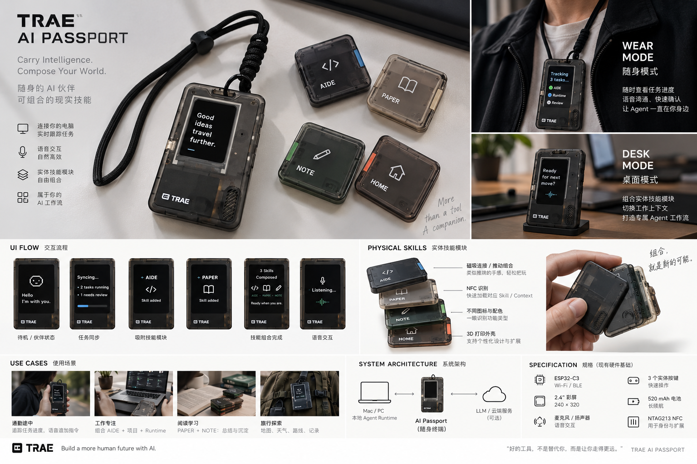

  <a href="README.zh_CN.md">简体中文</a> · <strong>English</strong>

# Earliest AI Passport Idea

This is the project's earliest product direction and should remain a standing reference for future design work.

The current project intentionally uses a pixel-art visual language. That is a presentation choice, not a change to the underlying interaction direction. Future pages and state changes should continue to take cues from this concept:

- a small AI companion with clear status and context;
- visible transitions between waiting, syncing, composing, listening, and completed states;
- modular capabilities that can be combined into a meaningful workflow;
- interaction that works across wearable and desk-like contexts;
- concise, glanceable UI with a sense of progression.

The image is a directional reference, not a confirmed hardware specification, copy deck, or implementation contract. Treat newly proposed details as ideas until they are separately agreed and documented.
